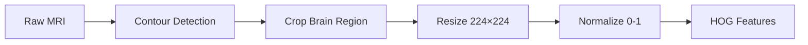

# 🧠 Brain Tumor Detection (MRI)

<div align="center">


**Binary classification of brain MRI scans using deep learning and computer vision**

[Features](#-features) • [Quick Start](#-quick-start) • [Usage](#-usage) • [Architecture](#-architecture)

</div>

---

> ⚠️ **Disclaimer:** This project is for educational and research purposes only. Not intended for clinical decision-making.

## ✨ Features

🔬 **Multiple Model Architectures**
- HOG-based MLP baseline (fast & lightweight)
- Optional SVM on HOG features
- CNN with data augmentation for improved accuracy

🎯 **Smart Preprocessing Pipeline**
- Automated brain contour detection
- Intelligent cropping and resizing
- HOG feature extraction with visualization

📊 **Comprehensive Evaluation**
- Confusion matrix & ROC curves
- Performance metrics (accuracy, precision, recall, F1)
- Visual reports generation

🖥️ **Interactive Streamlit Interface**
- Drag-and-drop image upload
- Real-time prediction with confidence scores
- Visual pipeline inspection (mask, HOG, preprocessed)

## 📁 Dataset

Using the [Brain Tumor Classification (MRI)]([https://www.kaggle.com/datasets/sartajbhuvaji/brain-tumor-classification-mri](https://www.kaggle.com/datasets/navoneel/brain-mri-images-for-brain-tumor-detection)) dataset from Kaggle.

**Expected structure:**
```
data/
├── yes/   # MRI scans with tumors
└── no/    # MRI scans without tumors
```

## 🚀 Quick Start

### Prerequisites
- Python 3.8+
- GPU recommended for CNN training (optional)

### Installation

```powershell
# Clone the repository
git clone <your-repo-url>
cd brain-tumor

# Create virtual environment
python -m venv venv
.\venv\Scripts\activate  # Windows PowerShell
# source venv/bin/activate  # Linux/Mac

# Install dependencies
pip install -r requirements.txt
```

### Train Your First Model

```powershell
# Download dataset and place in data/ directory

# Train HOG+MLP baseline
python train.py --data_dir data --model_dir models --epochs 20 --batch_size 32

# Evaluate performance
python evaluate.py --data_dir data --model_path models/best_mlp.h5 --scaler_path models/hog_scaler.pkl --output_dir reports

# Launch interactive app
streamlit run app.py
```

## 📖 Usage

### Training Models

**MLP Baseline (Recommended for quick experiments)**
```powershell
python train.py --data_dir data --model_dir models --epochs 20 --batch_size 32
```

**SVM on HOG Features**
```powershell
python train.py --data_dir data --model_dir models --train_svm
```

**CNN with Augmentation (Best accuracy)**
```powershell
python train.py --data_dir data --model_dir models --train_cnn --epochs 50
```

### Evaluation

```powershell
python evaluate.py \
  --data_dir data \
  --model_path models/best_mlp.h5 \
  --scaler_path models/hog_scaler.pkl \
  --output_dir reports
```

**Outputs:** Confusion matrix, ROC curve, classification report → `reports/`

### Single Image Prediction

```powershell
python predict.py \
  --image path\to\mri_scan.jpg \
  --model_path models/best_mlp.h5 \
  --scaler_path models/hog_scaler.pkl
```

### Interactive Web App

```powershell
streamlit run app.py
```

Upload an MRI scan and get:
- ✅ Tumor/No Tumor prediction
- 📊 Confidence score
- 🔍 Preprocessing visualization (original → mask → cropped → HOG)

## 🏗️ Architecture

```
preprocessing.py          # Brain contour detection, cropping, HOG extraction
augmentation.py           # Data augmentation configurations
model_architectures.py    # MLP, SVM, CNN model definitions
train.py                  # Training pipeline with model selection
evaluate.py               # Performance metrics & visualization
predict.py                # CLI inference tool
app.py                    # Streamlit web interface
```

### Preprocessing Pipeline



1. **Contour Detection** → Find brain boundary
2. **Smart Crop** → Extract largest contour (fallback: center crop)
3. **Resize** → Standardize to 224×224
4. **Normalize** → Scale pixels to [0,1]
5. **HOG Extraction** → Generate feature descriptors

## 🎯 Performance Tips

✅ **For Quick Experiments**  
Start with HOG+MLP → fast training, decent baseline

✅ **For Best Accuracy**  
Train CNN with augmentation → requires more data/time

✅ **Debugging Low Confidence**  
Check `reports/` visualizations → inspect mask quality and HOG features

✅ **Reproducibility**  
Seeds are pre-configured for consistent results across runs

## 🔧 Configuration

### GPU Setup (Optional)
For Windows users with NVIDIA GPU:
- CUDA 11.8
- cuDNN 8.6
- See `requirements.txt` for TensorFlow GPU setup

### Model Formats
Models save as `.h5` by default. For `.keras` format:
```python
model.save('model.keras')
```

## 📂 Project Structure

```
brain-tumor/
<<<<<<< HEAD
├── preprocessing.py       # Image processing utilities
=======
├── preprocessing.py        # Image processing utilities
>>>>>>> 0cb9e77bcb71b646a7afc1f964d064c5b53a9f41
├── augmentation.py        # Data augmentation configs
├── model_architectures.py # Model definitions
├── train.py               # Training script
├── evaluate.py            # Evaluation & metrics
├── predict.py             # CLI prediction
├── app.py                 # Streamlit web app
├── requirements.txt       # Python dependencies
├── .gitignore             # Excluded files/folders
├── data/                  # Dataset (excluded from Git)
│   ├── yes/
│   └── no/
├── models/                # Trained models (excluded from Git)
└── reports/               # Evaluation outputs (excluded from Git)
```

## 📝 Citation

Dataset: [Brain Tumor Classification (MRI)]([https://www.kaggle.com/datasets/sartajbhuvaji/brain-tumor-classification-mri](https://www.kaggle.com/datasets/navoneel/brain-mri-images-for-brain-tumor-detection))

## 🤝 Contributing

Contributions welcome! Please follow these guidelines:
- Use clear commit messages
- Test before submitting PRs
- Update documentation for new features

## 📄 License

This project is licensed under the MIT License - see the [LICENSE](LICENSE) file for details.

**Note:** While the code is MIT licensed, this project is intended for educational and research purposes. Not recommended for clinical or diagnostic use without proper medical validation.

---

<div align="center">

**Built by Dipesh Yadav using TensorFlow, Keras, and Streamlit**

[Report Bug](issues) • [Request Feature](issues)

</div>
